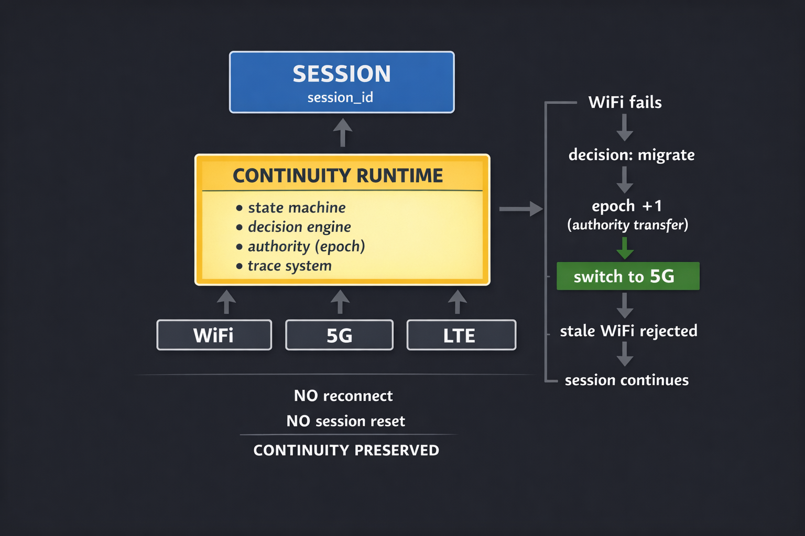

## Quick start (1 command)

Run the core demo:

```
go run ./cmd/migration_demo/main.go
```

Expected:

- WiFi fails
- system detects degradation
- migration happens
- session continues (no reset)

---

# Continuity Runtime Demo

> failure ≠ connection death  
> failure = runtime event  
> continuity is enforced, not recovered  

---

## ⚡ TL;DR

```
Session identity survives transport death without reconnect.
```

What this demo proves:

- no reconnect  
- no state rebuild  
- same session identity  
- transport can be replaced live  
- stale paths are rejected  

---

## What this is

An experimental Go prototype exploring **session continuity under transport volatility**.

Instead of binding identity to a connection, this project models:

- session as the primary object  
- transport as replaceable  
- continuity as invariant  

---

## 🧠 Mental model

Traditional systems:

```
connection = identity
```

→ when connection dies → identity dies  

---

Continuity Runtime:

```
session != transport
```

→ transport can die → session survives  

---

## Architecture



---

## Core idea

Traditional systems:

- connection drops  
- reconnect required  
- session reset  

This approach:

- failure is a runtime event  
- system evaluates alternatives  
- authority is transferred (epoch-based)  
- stale path is rejected  
- session continues  

---

## Core invariants

These properties define the system behavior:

- **Session identity survives transport death**
- **Only one authority per epoch**
- **Authority is monotonic (no rollback)**
- **Stale transports must not revive**
- **Continuity > optimality**

This is not an implementation detail — this is the contract.

---

## Runtime model (decision layer)

The system does NOT react to raw signals directly.

Instead it operates through **filtered, time-aware decisions**.

---

### Signal processing

Raw network signals are noisy.

We convert them into stable signals:

- RTT → EWMA (fast + slow)
- Packet loss → rolling window
- Jitter → smoothed deviation

Goal:

```
react to trends, not spikes
```

---

### State model

```
HEALTHY → DEGRADED → FAILED
```

Transitions are NOT instantaneous.

They require:

- K consecutive bad samples  
- time window validation  
- confidence threshold  

---

### Hysteresis (anti-flapping)

We intentionally introduce asymmetry:

- degrade → fast  
- recover → slow  

Example:

```
enter DEGRADED: 3 bad samples over 3s
enter FAILED: N missed heartbeats
recover: 10–30s stable window
```

Goal:

```
avoid oscillation under unstable conditions
```

---

### Decision engine

Instead of binary logic:

```
score(path) + confidence → decision
```

Where:

- score = latency + loss + stability  
- confidence = signal consistency over time  

Migration condition:

```
new_path_score - current_score > margin
AND confidence is high
```

This makes decisions:

- explainable  
- testable  
- reproducible  

---

## What is implemented

### Runtime

- state machine (ATTACHED → RECOVERING)  
- decision engine (score / confidence)  
- migration trigger  
- authority handoff (epoch model)  
- stale transport rejection  
- hysteresis + time-window gating  
- EWMA-based signal smoothing  

---

### Protocol

- wire packet format  
- versioning  
- replay protection  
- sequence window validation  
- session init / init ack  
- authority transfer  
- keepalive  
- close  

---

### Reliability

- ACK flow  
- retransmission policy  
- timeout policy  

---

### Simulation

- multiple transports (wifi / 5g / lte)  
- latency + jitter  
- packet loss  
- packet duplication  
- lossy exchange  
- two-node interaction  

---

### Observability

Designed for **decision explainability**:

- structured trace  
- timeline replay  
- invariant checks  
- decision logs  

Example:

```
[EVENT] WiFi degraded
[SIGNAL] rtt_ewma=182ms loss=0.12
[DECISION] migrate=true (margin=87.8, confidence=0.94)
[AUTHORITY] epoch 2 granted to 5G
[CHECK] stale WiFi rejected
```

---

## 🚀 Demos

### Handshake
```
go run ./cmd/handshake_demo/main.go
```

Shows:

- session init  
- init ack  
- keepalive  
- close  

---

### Migration (recommended)
```
go run ./cmd/migration_demo/main.go
```

Shows:

- data before failure  
- WiFi failure event  
- migration decision  
- authority transfer  
- data continues (no reset)  

---

### Two-node
```
go run ./cmd/two_node_demo/main.go
```

Shows:

- two nodes exchanging packets  
- ACK flow  
- lossy network behavior  
- migration + invariants  

---

## Example output

```
[EVENT] WiFi failed
[DECISION] migrate=true (margin=87.8, confidence=1.00)
[AUTHORITY] epoch 2 granted to 5G
[CHECK] stale WiFi rejected
[RESULT] session continues
```

---

## Key property

```
NO reconnect
NO session reset
CONTINUITY PRESERVED
```

---

## Why this matters

This is not about building "another VPN".

The question is:

**Can session continuity be preserved under failure without reconnect?**

If yes → this leads to:

- zero-reset mobile handoff  
- transport-independent sessions  
- next-gen VPN / overlay models  
- runtime-driven networking  

---

## Why this is hard

Real networks are:

- noisy (RTT spikes)  
- unstable (loss bursts)  
- inconsistent (NAT rebinding)  

Naive systems:

```
react too fast → flapping
react too slow → long recovery
```

This project explores:

```
controlled, explainable decision-making under uncertainty
```

---

## What makes this different

Most systems:

- recover after failure  

This model:

- avoids breaking the session in the first place  

It is closer to:

- session migration  
- authority transfer  
- runtime-controlled networking  

Not:

- retry logic  
- reconnect loops  

---

## Relation to existing systems

This problem space overlaps with:

- QUIC (connection migration)  
- MPTCP (multipath)  
- WireGuard (roaming)  

But differs in one key aspect:

> continuity is a **first-class invariant**, not a side-effect  

---

## Status

Early prototype.

What it is:

- protocol + runtime model  
- research-grade implementation  
- traceable + testable  

What it is not:

- production VPN  
- production crypto  
- congestion-controlled stack  

---

## Next steps

- real UDP / QUIC transport  
- retransmission improvements  
- packet scheduling  
- adaptive hysteresis tuning  
- formal protocol spec  
- protocol diagrams (flow, packet-level)  

---

## Direction

This repo is evolving:

```
demo → runtime → protocol → architecture
```

---

## Feedback

Looking for:

- protocol flaws  
- edge cases  
- invariant violations  
- migration race conditions  
- replay / stale-path issues  
- instability / flapping scenarios  

---

## 📦 Project structure

```
LICENSE
SECURITY.md
CONTRIBUTING.md
ROADMAP.md
SUPPORT.md
docs/
```

---

## 🧬 Protocol invariants

See:

```
docs/INVARIANTS.md
```

---

## 🔬 Flagship demo

See:

```
docs/FLAGSHIP_DEMO.md
```

---

## ❤️ Support

See:

```
SUPPORT.md
```